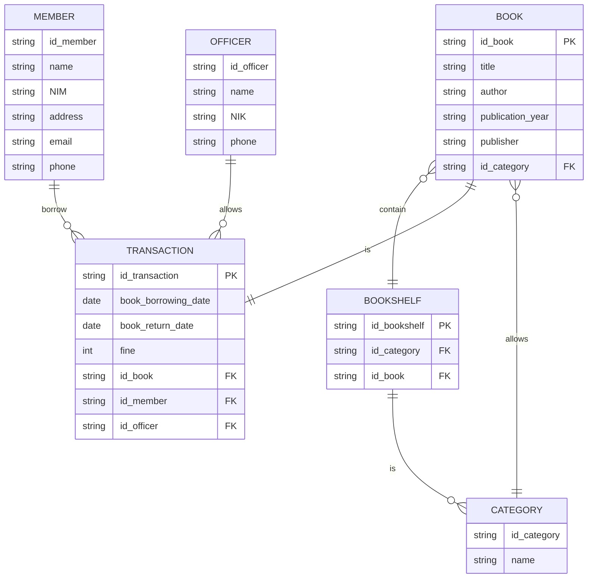

```mermaid

erDiagram
    BOOK {
        string id_book PK
        string title
        string author
        string publication_year
        string publisher
        string id_category FK
    }

    CATEGORY {
        string id_category
        string name
    }
    CATEGORY ||--o{ BOOK :allows

    BOOKSHELF {
        string id_bookshelf PK
        string id_category FK
        string id_book FK
    }
    BOOK }o--|| BOOKSHELF: contain
    BOOKSHELF ||--o{ CATEGORY: is

    OFFICER {
        string id_officer
        string name
        string NIK
        string phone
    }

    MEMBER {
        string id_member
        string name
        string NIM
        string address
        string email
        string phone
    }

    TRANSACTION {
        string id_transaction PK
        date book_borrowing_date
        date book_return_date
        int fine
        string id_book FK
        string id_member FK
        string id_officer FK
    }

    MEMBER ||--o{ TRANSACTION :borrow
    OFFICER ||--o{ TRANSACTION :allows
    BOOK ||--|| TRANSACTION:is


```
